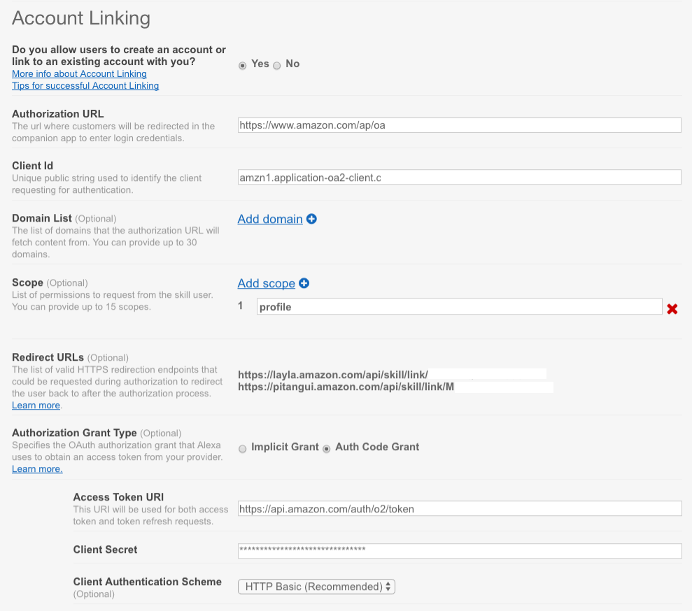

# Alexa-Demo

This is a simple Alexa Demo for use in workshops and lunch & learns. This section will cover sessions, 
and account linking.

## Sessions

Sessions variables are accessed via `attributes`. For example:

```javascript
this.attributes['hero'] = '';
this.attributes['firstName'] = '';
```
Sessions do not carry forward after the response has ended. The lifecycle of an Alexa conversation is:

1. Say 'Alexa' or other trigger word.
2. Say the name of your skill, in my case 'hammer'.
3. `LaunchRequest` is triggered, session remains alive until timeout, or `:responseReady`
4. If you add `listen(repromptSpeech)` at the end of your `speak()` statement, it will tell alexa to set
`this._responseObject.response.shouldEndSession = false;` which will keep your session alive.
5. `SessionEndedRequest` is fired when your session ends.

## Account Linking

This is done in two steps:

1. You need to configure your Alexa app for `Account Linking` will show this via DEMO.
2. You need to passs a user `accessToken` to amazon to obtain other information.

```javascript
    let amznProfileURL = 'https://api.amazon.com/user/profile?access_token=';
    amznProfileURL += this.event.session.user.accessToken;
    request(amznProfileURL, function(error, response, body) {
        let profile = JSON.parse(body);
        let firstName = profile.name.split(" ")[0];
        let speechOutput = "Hi, " + firstName + ". What would you like to know?";
        self.response.speak(speechOutput).listen(speechOutput);
        self.emit(':responseReady');
    });
```

## Developer.Amazon.Com - Part 1

* Apps & Services -> Security Profiles
* Create New Security Profile
* Note `Client ID` and `Client Secret`
* Fill in Privacy URL: `https://www.amazon.com/gp/help/customer/display.html?nodeId=468496`

## Account Linking Fill-in



* Authorization URL: `https://www.amazon.com/ap/oa`
* Client Id: `amzn1.application-oa2-client.xxxx` (Created In developer.amazon.com)
* Scope: `profile`
* Redirect Urls: `https://layla.amazon.com/api/skill/link/M1xxxxxx`, `https://pitangui.amazon.com/api/skill/link/M1xxxxxx` 
* API Token URI: `https://api.amazon.com/auth/o2/token`
* Client Secret: Created in developer.amazon.com
* Privacy Url: `https://www.amazon.com/gp/help/customer/display.html?nodeId=468496`

## Developer.Amazon.Com - Part 2

* Go back to security profile created in Part 1.
* Click on `Web Settings`
* Add these return URLS: `https://layla.amazon.com/api/skill/link/M1xxxxxx`, `https://pitangui.amazon.com/api/skill/link/M1xxxxxx` created in Account Linking Section.

## Useful Links

* [Alexa SSML Reference](https://developer.amazon.com/public/solutions/alexa/alexa-skills-kit/docs/speech-synthesis-markup-language-ssml-reference)
* [Account Linking Example](https://developer.amazon.com/blogs/post/Tx3CX1ETRZZ2NPC/Alexa-Account-Linking-5-Steps-to-Seamlessly-Link-Your-Alexa-Skill-with-Login-wit)
* [Interaction Model Reference](https://developer.amazon.com/public/solutions/alexa/alexa-skills-kit/docs/alexa-skills-kit-interaction-model-reference)

